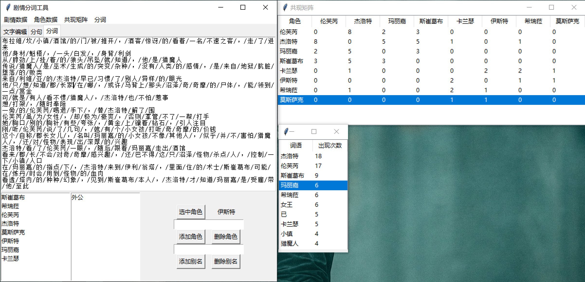

# 一个简单的剧情分析工具

## 简介

使用tkinter开发的简单的剧情~~分词~~分析工具。本工具的功能主要包括：

- 辅助用户对剧情文本提取角色和角色别名信息
- 根据用户录入的角色和角色别名信息，构建分词词典进行分词
- 根据分词信息构建共现矩阵
- 根据分词信息进行词频统计
- 支持导入和导出角色数据、共现矩阵、分词结果和词频数据
- 支持导入停用词（目前仅用于词频统计）和剧情文本

## 使用方法

启动方法：`python ui.py`

如图所示。选中“文字编辑”选项卡，可以粘贴剧情介绍。在下方可以添加角色和别名。**注意：在增删别名、删除角色前务必选择角色、确认上方角色名称正确！**

切换选项卡可以查看分句和分词效果。如不满意可以手动修改剧情介绍中的句子，但不能修改分句和分词选项卡中的内容（不能作用到最终结果中）。目前使用正则表达式`[.。;；!！……]`分割句子。

菜单中亦可以选择查看和导出词频、共现矩阵。

在本程序中，对于分词字典的操作是不断累积、不会清零的。如果需要将分词字典清空为初始状态，请在“分词”菜单中手动恢复。

本程序导出的文件均为JSON格式，且使用utf8转义.
